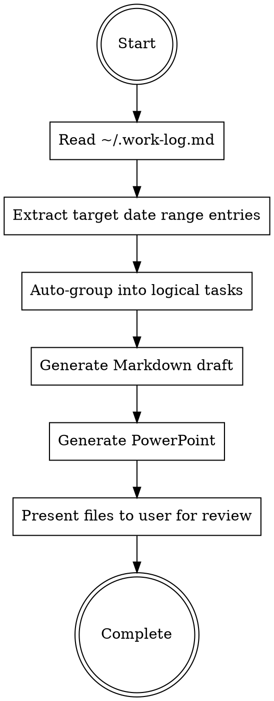

# Generating Weekly Reports

## Overview

Generate bilingual weekly reports in Markdown format, extracting content from daily work log (`~/.work-log.md`) and user-provided information.

## When to Use

Use when:
- User explicitly requests weekly report generation
- User mentions "周报", "週報", "weekly report"
- User asks to document progress for the week
- User references a week number (e.g., "week-2", "第二週")

Do NOT use for:
- General documentation (use project-specific docs)
- Daily logs or stand-ups
- Project proposals or planning documents

## Required Structure

**Multi-Task Model:** A weekly report contains multiple independent tasks. Each task has:

1. **Task Name** - Identifies the specific task
2. **Objective** - Goals for this task
3. **本週進度** - Progress made on this task
4. **困難** - Challenges encountered for this task
5. **解決方案** - Solutions for this task

**Data Structure:**
```
Week Report
├── Task 1
│   ├── Name
│   ├── Objective
│   ├── 本週進度
│   ├── 困難
│   └── 解決方案
├── Task 2
│   ├── Name
│   ├── ...
```

Each task is completely independent with its own four-element structure.

## Work Log Integration

**Data Source:** `~/.work-log.md` - Cross-project daily work log

**Format:**
```markdown
# Work Log 2026

## 2026-01-12 (Monday)
### [project-name] 16:38
- Work summary bullet 1
- Work summary bullet 2

### [another-project] 14:20
- Different project work
```

**Parsing Strategy:**
1. Read entire file (small, structured)
2. Extract date sections (`## YYYY-MM-DD`)
3. Extract project entries (`### [project] HH:MM`)
4. Group bullets under each project/timestamp
5. Filter by target week date range

**Usage:**
- Work log provides **reference material** only
- Show user grouped entries from the week
- User organizes content into task structure
- User supplements with objectives, challenges, solutions

**Critical:** Never copy work log bullets verbatim. User must structure content for report format.

## Content Extraction Process

**CRITICAL: Default to generating draft immediately.** Do NOT ask multiple rounds of questions. User prefers to review and edit a generated draft rather than answer detailed questions upfront.



### Step 1: Read Daily Work Log

**PRIMARY DATA SOURCE:** `~/.work-log.md` contains cross-project work entries recorded via sessionend hook or /summary command.

**Work log format:**
```markdown
## YYYY-MM-DD (Day)
### [project-name] HH:MM
- Work summary bullet points
- Session accomplishments
```

**Read the entire work log file** - it's structured and small enough to process completely.

### Step 2: Extract This Week's Entries

**Calculate week range:**
- Determine current date
- Find Monday of current week (or user-specified week)
- Extract all entries from Monday to Sunday

**Parse entries by:**
1. Date (## YYYY-MM-DD)
2. Project name ([project-name])
3. Timestamp and content

**Group structure:**
```
Week N (YYYY-MM-DD to YYYY-MM-DD)
├── Project A
│   ├── 2026-01-12 16:38: Summary 1
│   ├── 2026-01-13 09:15: Summary 2
├── Project B
│   ├── 2026-01-12 14:20: Summary 3
```

### Step 3: Auto-Group into Logical Tasks

**Group work log entries into logical tasks automatically:**
- Combine related projects into meaningful task categories
- Infer task names from project names and work content
- Synthesize Objective, 困難, 解決方案 from work log context

**Task grouping heuristics:**
- Same project = likely same task
- Related topics (e.g., multiple Android-related projects) = can combine into one task
- Infrastructure/tooling work = separate task
- Learning/research = can be a task if substantial

### Step 4: Generate Draft Immediately

**Do NOT ask user for task structure.** Generate a complete draft based on work log analysis:

1. **Task Name:** Derive from project names and content themes
2. **Objective:** Infer goals from what was accomplished
3. **本週進度:** Synthesize from work log bullets (rewrite, don't copy verbatim)
4. **困難:** Extract challenges mentioned in work log, or write "無" if none apparent
5. **解決方案:** Extract solutions mentioned, or write "無" if none apparent

**User reviews and edits the draft** rather than answering questions upfront.

## Format Specifications

### Markdown Format

**File naming:** `week-{N}.md` where N is the week number

**Structure:**
```markdown
# Week {N} 週報

---
**格式規範 (Format Specifications)**
- 中文字體 (Chinese Font): 微軟正黑體 (Microsoft JhengHei)
- 英文字體 (English Font): Calibri
- 一級項目 (Level 1): 字號 14pt
---

## Task 1: [任務名稱]

### Objective
  [Main goal 1 for this task]
  [Main goal 2 for this task]

### 本週進度
  [Substantial achievement with all details for this task]
  [Another substantial achievement for this task]

### 困難
  [Specific challenge for this task with impact described in one line]

### 解決方案
  [Concrete solution for this task with implementation details]

---

## Task 2: [任務名稱]

### Objective
  [Goal for task 2]

### 本週進度
  [Progress for task 2]

### 困難
  [Challenge for task 2]

### 解決方案
  [Solution for task 2]

---
```

**Critical formatting rules:**
- **Content items use 2-space indentation** - No bullet symbols (■, •, -, *)
- Each item on its own line with 2-space indent
- Tasks separated by `---` horizontal rules
- Each item should be **self-contained** with all details included
- Include format specifications header
- **Normally 2-3 items per section, keep concise**

## Implementation Workflow

1. **Read work log:** Use Read tool on `~/.work-log.md`
2. **Calculate date range:** Use user-specified range, or default to current week (Monday-Sunday)
3. **Extract and group:** Parse work log entries, auto-group into logical tasks
4. **Generate Markdown:** Create `week-N.md` with proper structure - DO NOT ask questions first
5. **Generate PowerPoint:** Call the generate_pptx.py script with: `python3 <plugin_path>/scripts/generate_pptx.py <week_number> <markdown_file> <output_pptx>`
   - To find the plugin path, use: `~/.claude/plugins/cache/*/weekly-report/*/scripts/generate_pptx.py` or the installed location
   - Example: `python3 ~/.claude/plugins/cache/glimmer2030-marketplace/weekly-report/1.0.0/scripts/generate_pptx.py 2 ./week-2.md ./week-2.pptx`
6. **Present to user:** Show file paths, let user review and request edits if needed

## Common Mistakes

| Mistake | Fix |
|---------|-----|
| Asking multiple rounds of questions before generating | Generate draft FIRST, let user edit after |
| Copying work log bullets verbatim | Rewrite and synthesize, don't copy directly |
| Skipping work log read | ALWAYS read ~/.work-log.md first |
| Fabricating content unrelated to work log | Base all content on work log entries |
| Using bullet symbols | No symbols - use 2-space indentation only |
| Missing format specs | Always include format header in Markdown |
| Missing task separators | Use `---` between each task |
| No indentation on content | All content items must have 2-space indent |
| Forgetting PowerPoint generation | After MD, call generate_pptx.py |
| Using `python` instead of `python3` | Always use `python3` command |

## Red Flags - STOP and Correct

- "Let me ask you about each task" → NO, generate draft first
- "Which entries are relevant?" → NO, auto-select and generate
- "What tasks do these represent?" → NO, infer and generate
- "I don't have search tools" → Use Read tool on ~/.work-log.md
- "I'll generate sample content" → Base on actual work log
- Using bullet symbols (■, •, -, *) → Use 2-space indentation only
- Forgetting `---` separators → Must separate all tasks with horizontal rules
- Content without indentation → All content items need 2-space indent
- Skipping PowerPoint generation → Must call generate_pptx.py
- Using `python` command → Use `python3` instead

## Rationalization Table

| Excuse | Reality |
|--------|---------|
| "Need to confirm task structure first" | Generate draft, user edits after |
| "User should organize the content" | Auto-organize, user reviews |
| "No work log available" | ~/.work-log.md always exists, read it |
| "Work log has all details" | Synthesize, don't copy verbatim |
| "Bullet symbols look better" | User specified indentation only, no symbols |
| "Skip PowerPoint generation" | Both MD and PPTX are required deliverables |

## Example Workflow

**Step 1: Read work log**
```markdown
## 2026-01-06 (Monday)
### [auth-module] 14:30
- Implemented JWT token refresh mechanism
- Added Redis integration for distributed locking

### [ci-cd-setup] 16:00
- Configured GitHub Actions pipeline
- Set up staging environment deployment

## 2026-01-08 (Wednesday)
### [auth-module] 10:15
- Fixed race condition in token refresh
- Deployed to staging environment
```

**Step 2: Auto-group into tasks**
- [auth-module] entries → Task 1: Authentication Module
- [ci-cd-setup] entries → Task 2: CI/CD Pipeline

**Step 3: Generate draft immediately** (week-N.md)
- Synthesize content from work log
- Infer objectives from accomplishments
- Extract difficulties and solutions if mentioned
- Write "無" for sections with no apparent content

**Step 4: Generate PowerPoint**
```bash
python3 ~/.claude/plugins/cache/glimmer2030-marketplace/weekly-report/1.0.0/scripts/generate_pptx.py 2 ./week-2.md ./week-2.pptx
```

**Step 5: Present to user**
```
完成。生成的檔案：
- Markdown: ./week-2.md
- PowerPoint: ./week-2.pptx

請檢視內容，如需修改再告訴我。
```

## Example Output

```markdown
# Week 2 週報

---
**格式規範 (Format Specifications)**
- 中文字體: 微軟正黑體
- 英文字體: Calibri
- 一級項目: 字號 14pt
---

## Task 1: Authentication Module Implementation

### Objective
  Complete authentication module implementation and deploy to staging
  建立 JWT token 機制實現用戶身份驗證

### 本週進度
  完成用戶認證模組開發包含 JWT token 機制和自動刷新功能並部署到測試環境
  建立前端登入頁面實現響應式 UI 設計並整合後端 API 錯誤處理

### 困難
  Token 刷新機制在高併發情況下出現競態條件導致用戶頻繁登出

### 解決方案
  採用 Redis 分布式鎖使用 SETNX 命令解決 token 刷新競態問題並添加過期時間防止死鎖

---

## Task 2: CI/CD Pipeline Setup

### Objective
  建立 CI/CD pipeline 實現自動化部署流程

### 本週進度
  設定 GitHub Actions CI/CD 流程實現自動測試和部署到 staging 環境

### 困難
  CORS 配置在生產環境與開發環境行為不一致造成 API 調用失敗

### 解決方案
  更新 CORS middleware 配置統一開發和生產環境設定並添加環境變量管理

---
```
