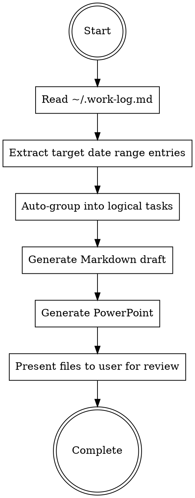

# Generating Weekly Reports

## Overview

Generate bilingual weekly reports in Markdown format, extracting content from daily work log (`~/.work-log.md`) and user-provided information.

## When to Use

Use when:
- User explicitly requests weekly report generation
- User mentions "周报", "週報", "weekly report"
- User asks to document progress for the week
- User references a week number (e.g., "week-2", "第二週")

Do NOT use for:
- General documentation (use project-specific docs)
- Daily logs or stand-ups
- Project proposals or planning documents

## Required Structure

**Multi-Task Model:** A weekly report contains multiple independent tasks. Each task has:

1. **Task Name** - Identifies the specific task
2. **Objective** - Goals for this task
3. **本週進度** - Progress made on this task
4. **困難** - Challenges encountered for this task
5. **解決方案** - Solutions for this task

**Data Structure:**
```
Week Report
├── Task 1
│   ├── Name
│   ├── Objective
│   ├── 本週進度
│   ├── 困難
│   └── 解決方案
├── Task 2
│   ├── Name
│   ├── ...
```

Each task is completely independent with its own four-element structure.

## Data Sources

**1. Work Log:** `~/.work-log.md` - Primary source for task structure.
- **Usage:** Extracts date-bound entries. `[project-name]` in the log defines the Task Name.

**2. Daily Memory:** `~/.openclaw/workspace/memory/YYYY-MM-DD.md` - Technical depth for the specific day.
- **Mapping Strategy:** The AI should look for **Header-based Mapping**. If the daily memory contains sections with project names (e.g., `## Project: Moss Sanity`), it must map that technical context directly to the corresponding `[MOSS_Sanity]` task in the report.
- **Restriction:** Use only daily memory files that fall within the weekly report's date range to ensure accuracy. Do NOT use long-term `MEMORY.md`.

## Parsing Strategy
1. **Target Range extraction:** Identify all `## YYYY-MM-DD` sections in the Work Log and matching `memory/YYYY-MM-DD.md` files for the week.
2. **Project-to-Task Mapping:** 
   - Extract `[project-name]` from Work Log.
   - Scan corresponding Daily Memory files for matching project headers or context.
3. **Synthesis:** Combine the high-level progress from the Work Log with the specific technical data (coordinates, script names, terminal results) found in the Daily Memory.
4. **Draft Generation:** Produce the final bilingual Markdown.

## Content Extraction Process

**CRITICAL: Default to generating draft immediately.** Do NOT ask multiple rounds of questions. User prefers to review and edit a generated draft rather than answer detailed questions upfront.



### Step 1: Read Daily Work Log

**PRIMARY DATA SOURCE:** `~/.work-log.md` contains cross-project work entries recorded via sessionend hook or /summary command.

**Work log format:**
```markdown
## YYYY-MM-DD (Day)
### [project-name] HH:MM
- Work summary bullet points
- Session accomplishments
```

**Read the entire work log file** - it's structured and small enough to process completely.

### Step 2: Extract This Week's Entries

**Calculate week range:**
- Determine current date
- Find Monday of current week (or user-specified week)
- Extract all entries from Monday to Sunday

**Parse entries by:**
1. Date (## YYYY-MM-DD)
2. Project name ([project-name])
3. Timestamp and content

**Group structure:**
```
Week N (YYYY-MM-DD to YYYY-MM-DD)
├── Project A
│   ├── 2026-01-12 16:38: Summary 1
│   ├── 2026-01-13 09:15: Summary 2
├── Project B
│   ├── 2026-01-12 14:20: Summary 3
```

### Step 3: Auto-Group into Logical Tasks

**Group work log entries into logical tasks automatically:**
- Combine related projects into meaningful task categories
- Infer task names from project names and work content
- Synthesize Objective, 困難, 解決方案 from work log context

**Task grouping heuristics:**
- Same project = likely same task
- Related topics (e.g., multiple Android-related projects) = can combine into one task
- Infrastructure/tooling work = separate task
- Learning/research = can be a task if substantial

### Step 4: Generate Draft Immediately

**Do NOT ask user for task structure.** Generate a complete draft based on work log analysis:

1. **Task Name:** Derive from project names and content themes
2. **Objective:** Infer goals from what was accomplished
3. **本週進度:** Synthesize from work log bullets (rewrite, don't copy verbatim)
4. **困難:** Extract challenges mentioned in work log, or write "無" if none apparent
5. **解決方案:** Extract solutions mentioned, or write "無" if none apparent

**User reviews and edits the draft** rather than answering questions upfront.

### 「困難」欄位判斷規則

「困難」和「解決方案」不能隨便寫「無」。以下情況必須填寫：

**必須寫「困難」的情況：**

| Work-log 中出現的關鍵字 | 說明 |
|-------------------------|------|
| fix、fixed、修、bug | 有修 bug 就有困難 |
| debug、debugging、排查 | 有 debug 就有困難 |
| error、fail、failed、失敗 | 遇到錯誤就是困難 |
| retry、重試、workaround | 有 workaround 表示原方案有問題 |
| issue、problem、問題 | 明確提到問題 |
| 卡、blocked、blocking | 被卡住就是困難 |
| race condition、deadlock、timeout | 技術問題 |
| permission、權限、403、401、unauthorized | 權限問題 |
| 不work、doesn't work、無法 | 東西壞了 |

**可以寫「無」的情況：**
- Work-log 只有「完成 X」「新增 Y」「建立 Z」這類單純的新增功能
- 沒有任何上述關鍵字出現
- 整個 task 只是文件撰寫或會議

**範例：**

Work-log 寫：
> 整合 uiautomator2 解決 uiautomator dump 失敗問題

❌ 錯誤：困難寫「無」
✓ 正確：
- 困難：uiautomator dump 有時回傳 "ERROR: could not get idle state"
- 解決方案：改用 uiautomator2 的 u2.dump_hierarchy()

Work-log 寫：
> 新增 /screen API endpoint

✓ 可以寫「無」（純新增功能，沒提到問題）

## 寫作風格（Anti-AI Patterns）

生成內容時，避免 AI 寫作痕跡。週報要讀起來像人寫的工作紀錄，不是 AI 生成的宣傳稿。

### 必須避免的模式

| 模式 | 問題 | 怎麼改 |
|------|------|--------|
| **三段式法則** | 「X、Y 和 Z」強行湊三項 | 兩項或四項更自然 |
| **AI 詞彙** | 此外、至關重要、增強、培養、展示、佈局、關鍵性的 | 直接刪掉或用白話替代 |
| **宣傳語言** | 充滿活力、豐富的、深刻的、開創性的、著名的 | 換成具體描述 |
| **-ing 膚淺分析** | 「...確保了...」「...展示了...」「...彰顯了...」 | 直接陳述事實 |
| **模糊歸因** | 「專家認為」「業界報告顯示」 | 給具體來源或刪掉 |
| **誇大意義** | 「標誌著」「體現了」「為...奠定基礎」 | 直接說做了什麼 |
| **否定式排比** | 「這不僅是...更是...」 | 直接說是什麼 |

### 寫作原則

1. **用具體細節** - 寫 commit hash、API 名稱、錯誤訊息、數字，而非「優化了系統」
2. **直接陳述** - 事實就是事實，不需要包裝
3. **信任讀者** - 不需要解釋為什麼這很重要
4. **變化節奏** - 長短句交替，不要每句都同樣結構

### 範例對比

| AI 味 ❌ | 自然 ✓ |
|----------|--------|
| 成功完成了關鍵性的效能優化工作，顯著提升系統效能 | 把 API response time 從 800ms 降到 120ms |
| 此外，解決了若干技術挑戰，確保系統穩定運行 | 修了 token refresh 的 race condition |
| 深入研究並實現了創新的解決方案 | 用 Redis SETNX 做 distributed lock |
| 本週工作展示了良好的技術能力與問題解決能力 | （刪掉，這種句子沒有資訊量） |
| 完成用戶認證模組開發，為後續功能奠定堅實基礎 | 完成 JWT login + refresh token，已部署到 staging |

### 中文 AI 措辭對照表

週報常見的 AI 味詞彙，遇到就換掉：

| AI 味 ❌ | 自然 ✓ | 說明 |
|----------|--------|------|
| 採用 | 用 | 「採用」太正式 |
| 實現 | 做了、寫了、加了 | 「實現」是翻譯腔 |
| 進行 | 做、跑、測 | 「進行測試」→「測了」 |
| 透過 | 用 | 「透過 API 取得」→「用 API 拿」 |
| 針對 | 對、處理 | 「針對此問題」→「這問題」 |
| 確保 | 讓、保證 | 「確保穩定」→「讓它穩定」 |
| 涵蓋 | 包含、有 | 「涵蓋三個模組」→「有三個模組」 |
| 識別 | 找到、發現 | 「識別問題」→「找到問題」 |
| 定位 | 找到 | 「定位根因」→「找到原因」 |
| 根本原因 | 原因 | 「根本原因」太正式 |
| 相關 | 這個、那個 | 「相關設定」→「這設定」 |
| 優化 | 改快、改好、調整 | 「優化效能」→「改快」 |
| 提升 | 變快、變好 | 「提升穩定性」→「更穩定了」 |
| 整合 | 接、串、加 | 「整合 API」→「接了 API」 |
| 建立 | 寫、做 | 「建立腳本」→「寫了腳本」 |
| 完善 | 補、加 | 「完善文件」→「補了文件」 |
| 若干 | 幾個、一些 | 「若干問題」→「幾個問題」 |
| 有效 | （通常可刪） | 「有效解決」→「解決了」 |
| 成功 | （通常可刪） | 「成功部署」→「部署了」 |
| 順利 | （通常可刪） | 「順利完成」→「完成了」 |

**句型替換：**

| AI 味 ❌ | 自然 ✓ |
|----------|--------|
| 採用 X 方式處理 Y 問題 | 用 X 處理 Y |
| 針對 X 進行了 Y | X 做了 Y |
| 透過 X 實現了 Y | 用 X 做 Y |
| 識別並定位了根本原因 | 找到原因了 |
| 涵蓋 X、Y、Z 等項目 | 有 X、Y、Z（或只列兩項） |
| 有效提升了系統穩定性 | 更穩定了 |
| 成功完成了 X 的開發 | X 寫完了 |

### 自我檢查

生成內容後快速檢查：
- 每個進度項目有沒有**具體的東西**（檔名、數字、技術名詞）？
- 刪掉任何「聽起來很厲害但沒說什麼」的句子
- 如果大聲唸出來會覺得尷尬，就重寫

---

## Format Specifications

### Markdown Format

**File naming:** `week-{N}.md` where N is the week number

**Structure:**
```markdown
# Week {N} 週報

---
**格式規範 (Format Specifications)**
- 中文字體 (Chinese Font): 微軟正黑體 (Microsoft JhengHei)
- 英文字體 (English Font): Calibri
- 一級項目 (Level 1): 字號 14pt
---

## Task 1: [任務名稱]

### Objective
  [Main goal 1 for this task]
  [Main goal 2 for this task]

### 本週進度
  [Substantial achievement with all details for this task]
  [Another substantial achievement for this task]

### 困難
  [Specific challenge for this task with impact described in one line]

### 解決方案
  [Concrete solution for this task with implementation details]

---

## Task 2: [任務名稱]

### Objective
  [Goal for task 2]

### 本週進度
  [Progress for task 2]

### 困難
  [Challenge for task 2]

### 解決方案
  [Solution for task 2]

---
```

**Critical formatting rules:**
- **Content items use 2-space indentation** - No bullet symbols (■, •, -, *)
- Each item on its own line with 2-space indent
- Tasks separated by `---` horizontal rules
- Each item should be **self-contained** with all details included
- Include format specifications header
- **Normally 2-3 items per section, keep concise**

## Implementation Workflow

1. **Read work log:** Use Read tool on `~/.work-log.md`
2. **Calculate date range:** Use user-specified range, or default to current week (Monday-Sunday)
3. **Extract and group:** Parse work log entries, auto-group into logical tasks
4. **Generate Markdown:** Create `week-N.md` with proper structure - DO NOT ask questions first
5. **Self-check quality:** Run the generated content through the quality checklist below. If score < 40/50, rewrite problematic sections before presenting to user.
6. **Offer optional PowerPoint generation:**
   - After Markdown is generated, ask the user (in Chinese is fine):
     > 已經幫你產生 week-N.md，要不要順便生成 PowerPoint 週報？
   - If the user says **no**:
     - Stop here and present only the Markdown path.
   - If the user says **yes**:
     - Use the builtin PPTX generator script:
       - `python3 <plugin_path>/scripts/generate_pptx.py <week_number> <markdown_file> <output_pptx>`
       - Example (for this plugin):
         - `python3 /home/william/projects/marketplace/plugins/weekly-report/scripts/generate_pptx.py 2 ./week-2.md ./week-2.pptx`
   - Present the generated PPTX path to the user.
7. **Present to user:** Show file paths (Markdown and PPTX if generated), let user review and request edits if needed

### Quality Self-Check (Step 5)

生成完 Markdown 後，對每個 Task 跑一次快速檢查：

| 檢查項目 | 扣分標準 |
|----------|----------|
| 有「此外」「至關重要」「展示了」等 AI 詞彙 | 每個 -2 分 |
| 有「成功完成」「順利實現」等空洞修飾 | 每個 -2 分 |
| 三項一組的列舉 (X、Y 和 Z) | 每處 -1 分 |
| 「本週進度」沒有具體數字、檔名、API 名稱 | 每個 Task -3 分 |
| 「困難」寫「無」但 work-log 有 debug/fix 紀錄 | 每個 Task -3 分 |
| 連續三句長度相近（字數差 < 5） | 每處 -1 分 |

**評分方式：** 從 50 分開始扣。

| 分數 | 處理方式 |
|------|----------|
| ≥ 40 | 直接呈現給 user |
| 35-39 | 標示有疑慮的段落，讓 user 決定是否修改 |
| < 35 | 自動重寫問題段落後再呈現 |

## Common Mistakes

| Mistake | Fix |
|---------|-----|
| Asking multiple rounds of questions before generating | Generate draft FIRST, let user edit after |
| Copying work log bullets verbatim | Rewrite and synthesize, don't copy directly |
| Skipping work log read | ALWAYS read ~/.work-log.md first |
| Fabricating content unrelated to work log | Base all content on work log entries |
| Using bullet symbols | No symbols - use 2-space indentation only |
| Missing format specs | Always include format header in Markdown |
| Missing task separators | Use `---` between each task |
| No indentation on content | All content items must have 2-space indent |
| Forgetting PowerPoint generation | After MD, offer optional PPTX generation using generate_pptx.py |
| Using `python` instead of `python3` | Always use `python3` command |
| 用「此外」「關鍵性」等 AI 詞彙 | 直接刪掉或用白話說 |
| 寫「成功完成了...」「顯著提升...」 | 寫具體數字或技術細節 |
| 三項一組的列舉 | 改成兩項或四項 |
| 沒有具體細節的進度描述 | 加入檔名、API 名稱、數字 |
| 結尾加「為...奠定基礎」之類的話 | 刪掉，沒有資訊量 |
| Work-log 有 fix/debug/error 但困難寫「無」 | 從 work-log 提取實際遇到的問題 |
| 用「採用」「實現」「透過」「針對」 | 換成「用」「做了」「對」等白話 |
| 跳過 Quality Self-Check | 生成後必須跑一次品質檢查 |
| 品質分數 < 35 卻直接呈現 | 分數太低要先重寫再呈現 |

## Red Flags - STOP and Correct

- "Let me ask you about each task" → NO, generate draft first
- "Which entries are relevant?" → NO, auto-select and generate
- "What tasks do these represent?" → NO, infer and generate
- "I don't have search tools" → Use Read tool on ~/.work-log.md
- "I'll generate sample content" → Base on actual work log
- Using bullet symbols (■, •, -, *) → Use 2-space indentation only
- Forgetting `---` separators → Must separate all tasks with horizontal rules
- Content without indentation → All content items need 2-space indent
- Skipping PowerPoint generation → Must offer optional PPTX generation using generate_pptx.py
- Using `python` command → Use `python3` instead
- 寫出「此外」「至關重要」「展示了」→ 刪掉重寫
- 寫出「成功完成了關鍵性的...」→ 改成具體做了什麼
- 每個進度都是「完成了 XXX 功能」的句型 → 變化句型，加細節
- 內容讀起來像新聞稿或宣傳文 → 改成工程師的工作紀錄口吻
- Work-log 有 "fix"/"debug"/"error" 但困難寫「無」→ 回去找問題描述
- 用了「採用」「實現」「透過」「針對」「涵蓋」→ 查對照表換成白話
- 品質檢查分數 < 35 卻沒重寫 → 必須重寫後再呈現
- 連續三句長度差不多 → 打散，混用長短句

## Rationalization Table

| Excuse | Reality |
|--------|---------|
| "Need to confirm task structure first" | Generate draft, user edits after |
| "User should organize the content" | Auto-organize, user reviews |
| "No work log available" | ~/.work-log.md always exists, read it |
| "Work log has all details" | Synthesize, don't copy verbatim |
| "Bullet symbols look better" | User specified indentation only, no symbols |
| User explicitly requested PPTX but you never offered it | Always offer optional PPTX generation after Markdown is created using builtin generator |
| User chose PPTX generation but you did not run any command | Ensure you actually run the builtin generator command when user says yes |
| 「這樣寫比較正式」 | 週報不是論文，正常講話就好 |
| 「加一些修飾詞比較完整」 | 沒有資訊量的修飾詞就是廢話 |
| 「三項比較有結構感」 | 刻意湊三項反而暴露 AI 痕跡 |
| 「work-log 沒提到困難」 | 有 fix/debug/error 就表示有困難，回去找 |
| 「困難和解決方案是 optional」 | 有困難就必須填，只有純新增功能才能寫無 |
| 「品質檢查太花時間」 | 檢查只需幾秒，重寫比被退稿快 |
| 「user 會自己改」 | 你的職責是產出高品質初稿，不是丟草稿給人改 |

## Example Workflow

**Step 1: Read work log**
```markdown
## 2026-01-06 (Monday)
### [auth-module] 14:30
- Implemented JWT token refresh mechanism
- Added Redis integration for distributed locking

### [ci-cd-setup] 16:00
- Configured GitHub Actions pipeline
- Set up staging environment deployment

## 2026-01-08 (Wednesday)
### [auth-module] 10:15
- Fixed race condition in token refresh
- Deployed to staging environment
```

**Step 2: Auto-group into tasks**
- [auth-module] entries → Task 1: Authentication Module
- [ci-cd-setup] entries → Task 2: CI/CD Pipeline

**Step 3: Generate draft immediately** (week-N.md)
- Synthesize content from work log
- Infer objectives from accomplishments
- Extract difficulties and solutions if mentioned
- Write "無" for sections with no apparent content

**Step 4: Generate PowerPoint**
```bash
python3 ~/.claude/plugins/cache/glimmer2030-marketplace/weekly-report/1.0.0/scripts/generate_pptx.py 2 ./week-2.md ./week-2.pptx
```

**Step 5: Present to user**
```
完成。生成的檔案：
- Markdown: ./week-2.md
- PowerPoint: ./week-2.pptx

請檢視內容，如需修改再告訴我。
```

## Example Output

```markdown
# Week 2 週報

---
**格式規範 (Format Specifications)**
- 中文字體: 微軟正黑體
- 英文字體: Calibri
- 一級項目: 字號 14pt
---

## Task 1: Authentication Module

### Objective
  完成 JWT 登入機制，部署到 staging

### 本週進度
  實作 /auth/login 和 /auth/refresh 兩支 API，token 有效期 15 分鐘
  前端登入頁完成，錯誤時顯示後端回傳的 error message

### 困難
  多個 request 同時打 /auth/refresh 會拿到不同的 token，造成其中幾個 401

### 解決方案
  用 Redis SETNX 做 lock，第一個 request 更新 token，其他 request 等 50ms 後重試拿新 token

---

## Task 2: CI/CD Pipeline

### Objective
  PR merge 後自動跑測試、自動部署 staging

### 本週進度
  GitHub Actions workflow 完成，跑 pytest + deploy to staging
  加了 Slack 通知，deploy 成功或失敗都會發訊息到 #dev-notifications

### 困難
  staging 的 CORS 設定跟 local 不同，前端打 API 全部被擋

### 解決方案
  把 allowed origins 改從環境變數讀，local 用 localhost:3000，staging 用實際 domain

---
```
